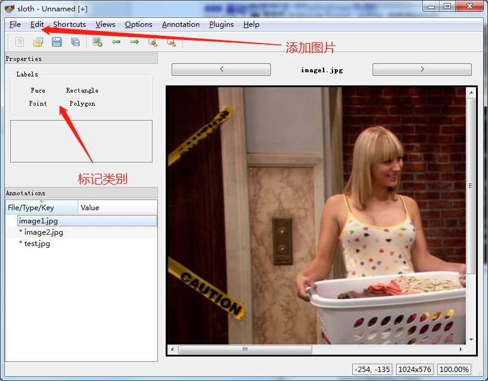
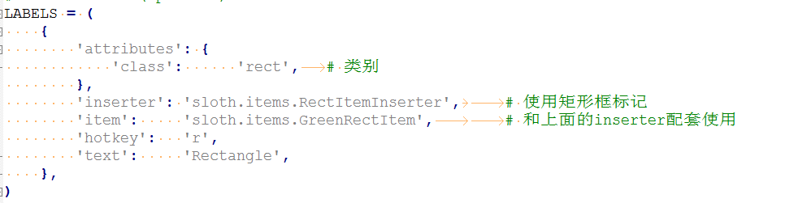
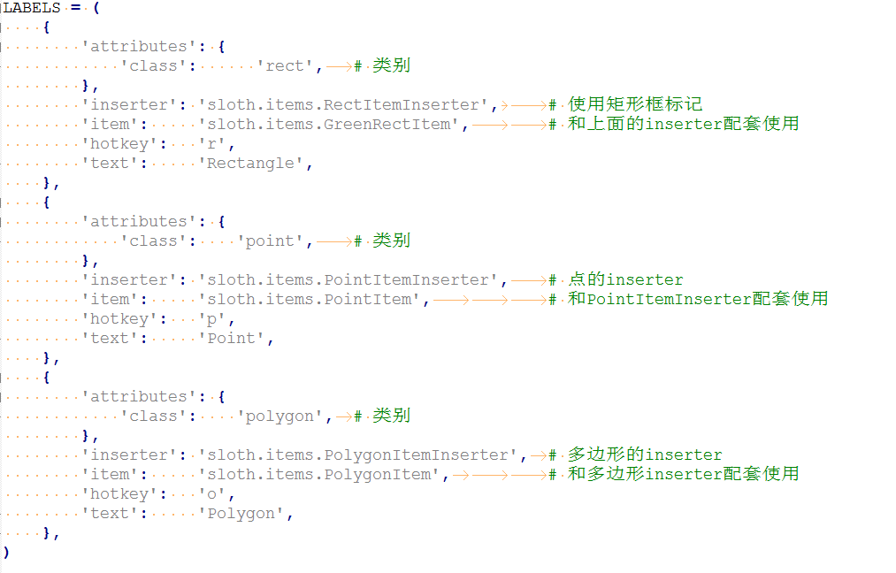

sloth
=====

这是一份简要版中文说明关于如何使用Sloth进行图像标注。 

## 运行环境
python3.6及以上，因为支持中文

## Sloth安装

### 安装前准备
#### 安装依赖库(Anaconda 推荐)
    conda install --file requirements.txt
    
#### Or 安装依赖库(pip)
    pip install -r requirements.txt
使用这种方法安装PyQt4时可能会遇到问题，需要手动安装PyQt4. 安装包可以在[link PyQt4](https://www.lfd.uci.edu/~gohlke/pythonlibs/#pyqt4)找到。然后使用下面这条命令(依然有风险遇到问题)  
  
    pip install [包名]
    
### 安装
在sloth项目所在文件运行
  
    python setup.py install    

### 运行

##### Windows
sloth的入口在sloth/bin/sloth  

    python sloth/bin/sloth 

##### Linux
直接在Terminal输入 sloth 即可

### 基础使用方法 (以windows为例)
首先打开sloth
    
    python sloth/bin/sloth
    

多边形（Polygon）类型在框出对象之后，双击表示确定。

所有图片的标记结果都会保存在一个json文件中。

#### 自定义标注类别（修改配置文件）
sloth支持修改configure文件自定义标注类别。首先使用自定义配置文件

    python sloth/bin/sloth --config [myconfig.py]   

通过自定义config.py文件来定义不同的类别和标注方式，和类别相关的部分是LABELS。只包含一个类别的LABELS定义如下图

这里介绍三种标记方式，点，矩形，多边形。  
  

## 官方文档
https://sloth.readthedocs.io/en/latest/index.html

